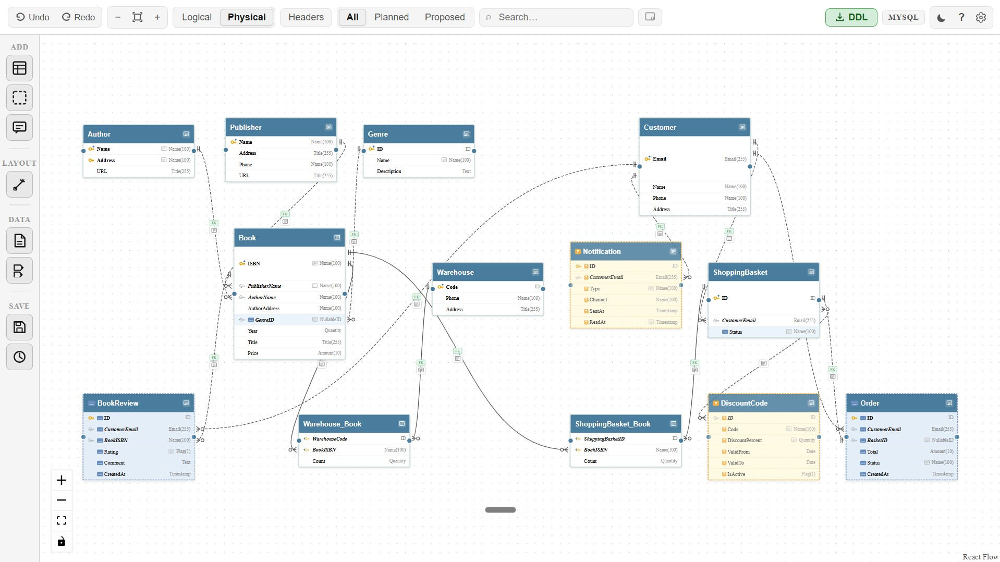
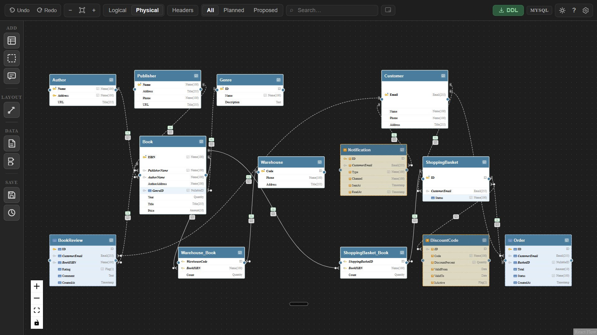
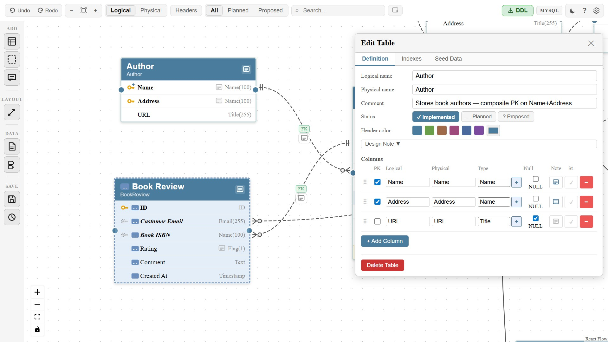
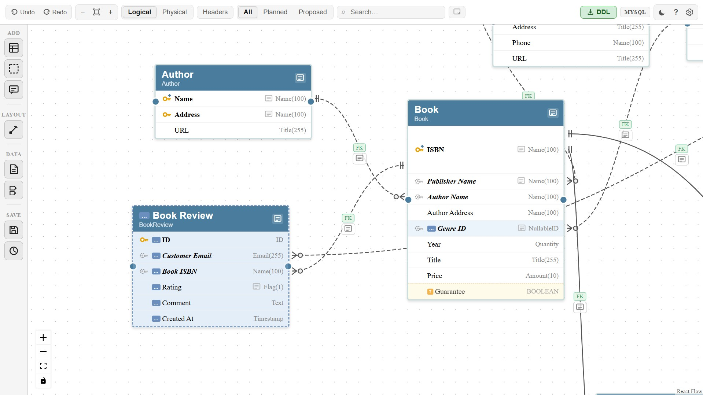
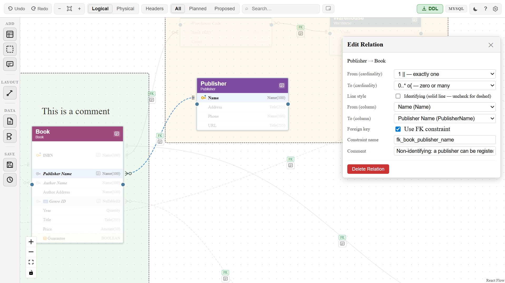
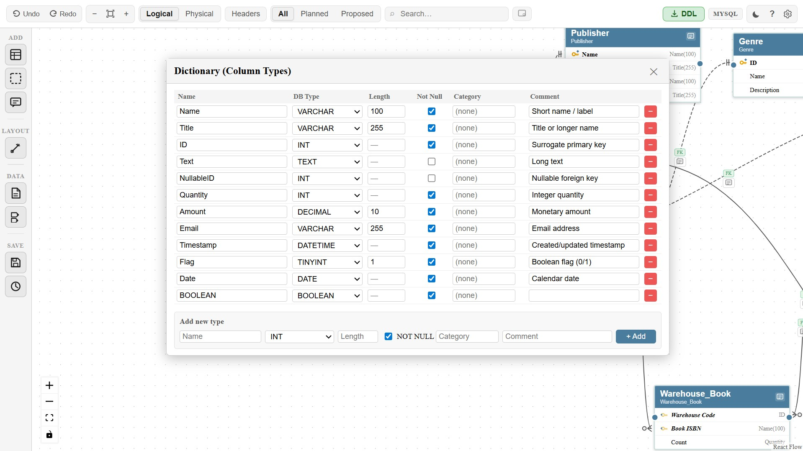
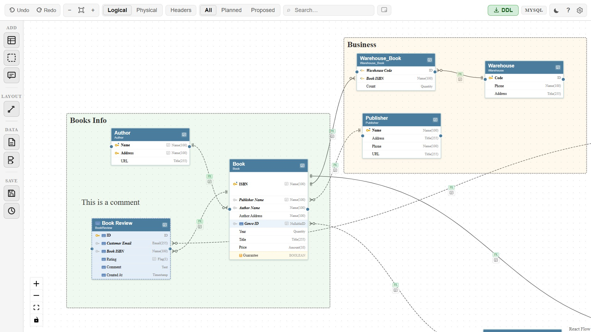

# ERD Markdown

**VSCode extension — Interactive ER diagram editor backed by plain `.ermd` files.**



> The complete bookstore schema in light mode — crow's foot relations, key icons, status tints, and the full toolbar visible.

---

## Overview

**ERD Markdown** lets you design and maintain ER diagrams entirely inside VSCode.  
The diagram is stored in a `.ermd` file (with `er-diagram: true` in the front matter), so it is **human-readable, diffable, and version-control friendly** — no proprietary binary format, no separate toolchain.



> The same schema in dark mode. Toggle with the ☀/🌙 button in the toolbar.

---

## Features

### Canvas & Navigation

| Feature | Details |
|---|---|
| **Interactive canvas** | Drag tables to reposition, resize with handles, pan & zoom |
| **Dark / Light theme** | Toggle between dark and light mode with the ☀/🌙 button in the toolbar |
| **Minimap** | Show/hide the minimap overlay |
| **Auto Layout** | Arrange tables automatically — Vertical, Horizontal, or Auto (via sidebar flyout) |
| **Search & focus** | Search tables and columns by name; matching columns highlight while others dim |
| **Relation focus** | Click a relation to dim all other tables and highlight the two connected columns |
| **Headers-only mode** | Collapse all tables to show only headers and simplified relation lines |

### Tables & Columns

| Feature | Details |
|---|---|
| **Table editing** | Double-click any table to open the edit panel with sticky header and tab bar |
| **Column reordering** | Drag columns by their handle to reorder; animated drop indicator shows the target position |
| **Implementation status** | Mark each table or column as `implemented` / `planned` / `proposed` — shown visually with color tints and badges |
| **Status filter** | Toolbar pill (All / Planned / Proposed) focuses only matching tables and columns across the whole diagram |
| **Logical / Physical names** | Toggle between display names and DB names with one click |
| **Column-type dictionary** | Define reusable DB types (e.g. `ID → INT`, `Name → VARCHAR(100)`) and apply them to columns |
| **Inline type registration** | Type any name; unrecognised types show an amber border and `+` button to register inline |
| **Seed data editor** | Enter initial rows per table in the Seed Data tab; undo-able and git-diffable |

#### Edit Table panel

Double-click any table to open the full edit panel — rename, set status, pick header color, manage columns, add design notes, and edit seed data all in one place.



#### Implementation status — planned & proposed

Tables and columns can be marked `planned` (blue tint, dashed border) or `proposed` (amber tint, dashed border). The **Planned / Proposed** filter in the toolbar dims everything else so you can focus on what is still to be built — even individual columns inside an otherwise implemented table.



### Relations

| Feature | Details |
|---|---|
| **Crow's foot notation** | Drag between column handles to create relations; cardinality ends shown as `\|\|`, `o\|`, `o{`, `\|{` |
| **Identifying vs non-identifying** | Solid line = child depends on parent; dashed = independent |
| **FK constraint** | Optionally attach a named `FOREIGN KEY` constraint to any relation |
| **Multi-connection fan-out** | Columns with multiple relations expand their row height so each line exits from a distinct point |
| **Key icons** | Plain PK 🔑, Referenced PK 🔑+diamond, Identifying FK, Non-identifying FK — each with a distinct icon |
| **Relation comments** | Attach a note to any relation; click the note icon on the line to read it |

#### Edit Relation panel

Click any relation line to open the edit panel — adjust cardinality on both ends, switch between identifying and non-identifying, bind to specific columns, toggle the FK constraint and name it, and add a comment.



### Column Type Dictionary

Define reusable column types once and apply them everywhere. Built-in presets (ID, Name, Email, Flag, Timestamp …) are included; add your own with the inline form.



### Annotations

| Feature | Details |
|---|---|
| **Region group boxes** | Group related tables with a labeled background rectangle; full style control (color, font, border) |
| **Text comments** | Free-floating text nodes with font, color, and background styling |
| **Table & column notes** | Attach design notes to tables and columns; click the note icon to toggle a popover |
| **Legend panel** | Click `?` in the toolbar for a full reference: key icons, cardinality endings, line styles, DB types, shortcuts |

#### Regions and comments

Use region boxes to group related tables visually and text comments to annotate any area of the canvas. Both support full style customization via the 🎨 picker.



### Import & Export

| Feature | Details |
|---|---|
| **Unified CSV import** | One CSV covers tables, columns, relations, comments, design notes and implementation status |
| **Built-in presets** | 14 named type presets (ID, Name, Email, Flag, Timestamp …) resolved automatically from `dictionaryName` |
| **DDL export** | Full `CREATE TABLE` DDL or diff-only `ALTER TABLE` against a git baseline or a saved version |
| **Dialect support** | MySQL, PostgreSQL, SQLite, SQL Server — switch in Settings, badge shown live in toolbar |
| **INSERT export** | Optionally include seed data as `INSERT INTO` statements |
| **Schema versioning** | Save named snapshots; generate `ALTER TABLE` DDL between any two snapshots |

---

## Getting started

### Install

Search for **"ERD Markdown"** in the VSCode Extensions panel and click **Install**.

#### Build from source

```bash
git clone https://github.com/PabloGonzalezMartin/ERD-markdown.git
cd ERD-markdown
npm install
cd webview && npm install && cd ..
npm run build
```

Press **F5** in VSCode to launch the Extension Development Host.

### Open a diagram

1. Create a `.ermd` file with the following front matter (or import `examples/crowfoot-bookstore-example.csv`):

```yaml
---
er-diagram: true
version: 1
---

# My ER Diagram
```

2. Click the **⊹** icon in the editor title bar, or right-click the file → **Open as ER Diagram**.

---

## Usage

### Toolbar overview

The toolbar groups controls into pill sections:

| Group | Controls |
|---|---|
| **History** | Undo / Redo |
| **Zoom** | − / Fit / + |
| **View** | Logical / Physical name toggle, Headers-only |
| **Status filter** | All / Planned / Proposed |
| **Search** | Filter tables and columns by name |
| **Map** | Toggle minimap |
| **Right side** | Export DDL, dialect badge, theme toggle, legend `?`, settings ⚙ |

### Sidebar overview

The left sidebar provides icon buttons grouped by function:

| Section | Buttons |
|---|---|
| **ADD** | Add Table, Add Region, Add Comment |
| **LAYOUT** | One button → flyout with Horizontal / Vertical / Auto |
| **DATA** | Import CSV, Column Type Dictionary |
| **SAVE** | Save Version, View Versions |

### Add and edit tables

Click **Add Table** in the sidebar. Double-click any table to open the **Table Edit Panel**.

- Set logical name, physical name, comment and design note
- Choose an **implementation status**: `✓ Implemented` / `… Planned` / `? Proposed`
- Set header color with color swatches or a color picker
- Add columns with **+ Add Column**

Changing a table's status automatically propagates to all its columns.

### Column status and reordering

Each column row in the edit panel has:

- A **status cycle button** (`✓` → `…` → `?`) to set `implemented` / `planned` / `proposed`
- A **drag handle** on the left — drag to reorder; an animated blue line shows where the column will land

### Implementation status — visual guide

| Status | Table look | Column look |
|---|---|---|
| `implemented` | Normal solid border | Normal row |
| `planned` | Dashed blue border, faint blue tint | Faint blue tint, `…` badge |
| `proposed` | Dashed amber border, faint yellow tint | Faint yellow tint, dashed top border, `?` badge, 80% opacity |

### Regions and comments

**Regions** — click **Add Region** in the sidebar. When selected:
- 🎨 button opens the style picker (font size, font family, text color, border color, background)
- ✕ button deletes the region
- Resize by dragging any edge or corner handle

**Comments** — click **Add Comment** in the sidebar. When selected:
- Same 🎨 / ✕ toolbar as regions
- Double-click to edit the text inline

The style picker stays open while you pick colors and fonts — it closes only when you click outside it.

### Relations

Drag from the **◉ handle** on a source column to a target column to create a relation.  
Click the relation line to open the **Relation Edit Panel**:

- **From / To cardinality** — `0..1`, `1`, `0..*`, `1..*`
- **Line style** — identifying (solid) or non-identifying (dashed)
- **From / To columns** — refine which columns are linked
- **FK constraint** — toggle and name the constraint
- **Comment** — click the note icon on the line to read/hide

Clicking a relation also **centers the view** on the two connected tables, leaving space for the edit panel on the right.

**Key icons in table rows:**

| Icon | Meaning |
|---|---|
| Yellow key | Plain primary key — not yet referenced |
| Yellow key + blue diamond | PK that is referenced as an FK source in another table |
| Faded yellow key + blue arrow | Identifying FK (solid relation) |
| Grey dashed key | Non-identifying FK (dashed relation) |

### Search and focus

Type in the **Search** box to filter:
- Tables whose **name** matches → header highlighted, all column rows dimmed
- Tables with **column name** matches → matching column rows highlighted, others dimmed
- Relation lines → fade to near-invisible while a search is active

Use the **Planned / Proposed** filter pills to focus in-progress work — tables and columns that don't match are faded to 20% opacity.

### Unified CSV import

Click **Import CSV** (DATA section in sidebar).

The single CSV format covers everything — tables, columns, relations, comments, design notes and status:

```
tableLogicalName,tablePhysicalName,tableComment,columnLogicalName,columnPhysicalName,
dictionaryName,dbType,length,notNull,isPrimaryKey,isNullable,defaultValue,columnComment,
columnDesignNote,tableDesignNote,relFromTable,relFromColumn,relToTable,relToColumn,
relCardinality,relIdentifying,relHasFk,relConstraint,relComment
```

- **Table+column rows** — fill the table and column fields; leave `rel*` columns blank
- **Relation rows** — fill only `rel*` columns; leave all table/column fields blank
- `relIdentifying: true` → solid identifying line; `false` → dashed non-identifying line
- `tableDesignNote` / `columnDesignNote` → sets design notes visible in the edit panel

**Built-in type presets** (usable as `dictionaryName`):

| Name | dbType | length | notNull |
|---|---|---|---|
| ID | INT | — | true |
| BigID | BIGINT | — | true |
| Name | VARCHAR | 100 | true |
| Title | VARCHAR | 255 | true |
| Email | VARCHAR | 255 | true |
| Code | VARCHAR | 20 | true |
| Text | TEXT | — | false |
| Flag | TINYINT | 1 | true |
| Quantity | INT | — | true |
| Amount | DECIMAL | 10 | true |
| Timestamp | DATETIME | — | true |
| Date | DATE | — | true |
| JSON | JSON | — | false |
| NullableID | INT | — | false |

A worked example with crow's foot notation, planned/proposed tables, design notes, and relations is in `examples/crowfoot-bookstore-example.csv`.  
A reusable AI prompt to generate CSVs for any domain is in `docs/prompts/prompt-csv-generator.md`.

### Schema versioning

Click **Save Version** (sidebar → SAVE). A name prompt opens — enter e.g. `v1.0` or `before-refactor`.  
Click **View Versions** to list saved snapshots — each row shows name, date, table count, relation count, and a Delete button.

To generate diff DDL: **Export DDL** → select **Version Diff** → choose From and To versions.

### Export DDL

Click **Export DDL** in the toolbar. Options in the modal:

| Option | Effect |
|---|---|
| **Full DDL** | `CREATE TABLE` + `ALTER TABLE ADD FOREIGN KEY` |
| **Version Diff** | `ALTER TABLE` statements between two saved snapshots |
| **Include seed data as INSERT** | Appends `INSERT INTO` for tables with seed data |
| **Skip auto-increment PK columns** | Omits PK columns from INSERT lists |

---

## Keyboard shortcuts

| Key | Action |
|---|---|
| `Ctrl+Z` | Undo |
| `Ctrl+Y` / `Ctrl+Shift+Z` | Redo |
| `Delete` | Delete selected table, relation, region or comment |
| Double-click table | Open table edit panel |
| Double-click region | Rename region label |

---

## File format

The diagram is stored in a `.ermd` file using YAML front matter and `ermd-*` fenced blocks:

````
---
er-diagram: true
version: 1
---

# EC Site

## Dictionary

```ermd-dictionary
- id: dict_id
  name: ID
  dbType: INT
  length: null
  notNull: true
  comment: ""
```

## Tables

```ermd-table
id: tbl_user
logicalName: User
physicalName: users
comment: "Registered users"
status: implemented
columns:
  - id: col_u1
    logicalName: User ID
    physicalName: user_id
    dictionaryId: dict_id
    isPrimaryKey: true
    isNullable: false
    defaultValue: null
    comment: ""
    status: implemented
```

## Relations

```ermd-relations
- id: rel_1
  fromTableId: tbl_user
  fromColumnId: col_u1
  toTableId: tbl_order
  toColumnId: col_o2
  fromCardinality: EXACTLY_ONE
  toCardinality: ZERO_OR_MANY
  identifying: true
  hasForeignKey: true
  constraintName: fk_orders_user_id
  comment: "A user can place many orders"
```

## Layout

```ermd-layout
nameMode: logical
tables:
  - tableId: tbl_user
    x: 60
    y: 60
    width: 260
viewport:
  x: 0
  y: 0
  zoom: 1
regions: []
```
````

---

## License

MIT — see [LICENSE](LICENSE)

---

## For contributors

See [CLAUDE.md](CLAUDE.md) for architecture notes, build commands, and PR checklist.
